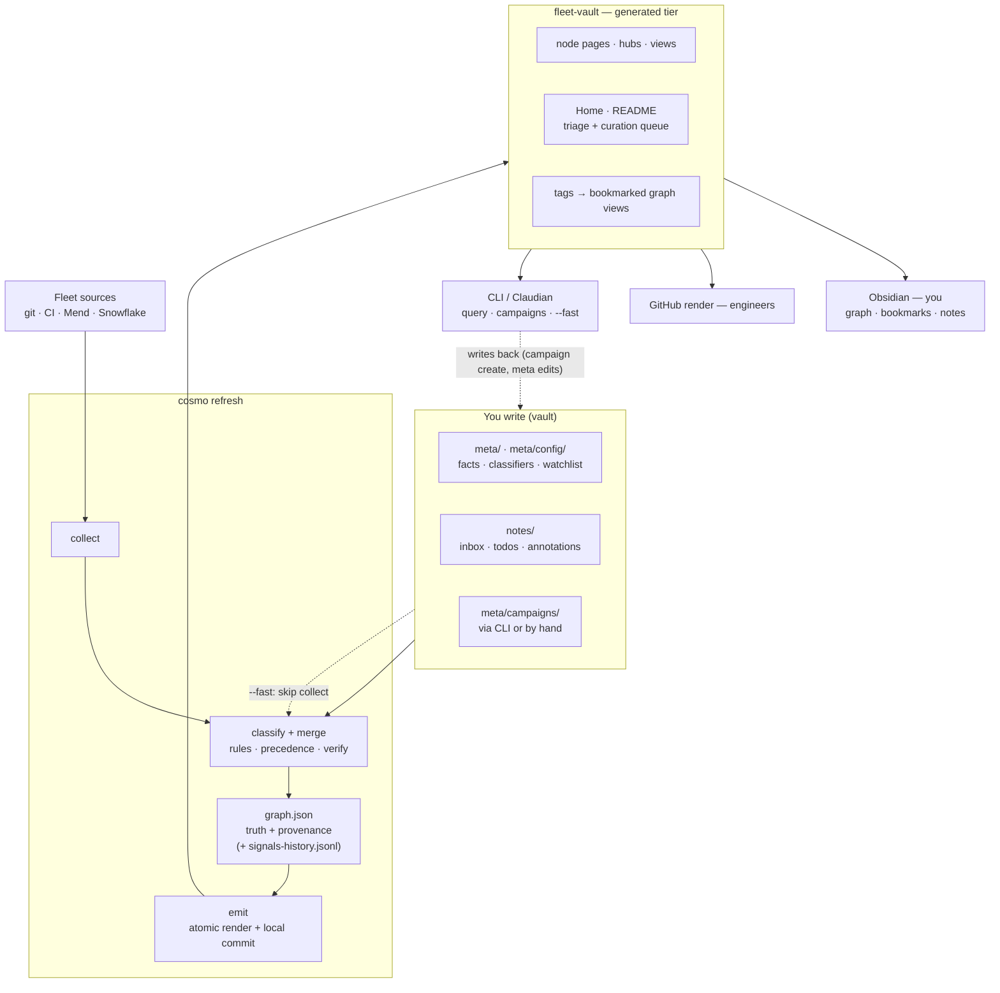

# SPEC ADDENDUM A (v2.1) — Command Center, Phased & Verdict-Gated

Status: DRAFT — V1 begins with reconciliation (V1.0); do not execute past a gate without the human's explicit go.
Parent: SPEC.md (last chat-verified 1.25; repo may be ahead — V1.0 resolves).
Supersedes: v2 (folds in: classifier/predicate engine, minimal meta in V1, `--fast`, vault-side fleet config, CLI agent contract, CLAUDE.md seed, needs-curation queue, campaign members write-back carve-out, sets cut, Mend fallback, tag-then-prune).
Deferred, own future mini-specs: SPA physics (trigger: demo date), Quartz/Pages (trigger: hosting + named consumer), extraction flip (AMENDMENTS-2 #1).

---

## 0. Architecture (normative summary)



(ASCII fallback for terminals:)

```
        WRITE SURFACES (human, markdown — ALL in the vault)
  notes/inbox/  notes/**  meta/*.md  meta/campaigns/*.md
  meta/config/classifiers.md  watchlist.md  watch-rules.md
        └────────────┬───────────────────────────┘
                     ▼
  cosmo refresh: collect ─► classify ─► merge ─► verify ─► graph.json ─► emit
  cosmo refresh --fast:      (skip collectors: re-ingest meta+config, classify,
                              derive, emit — seconds; the curation feedback loop)
                     │                                  │
             signals-history.jsonl              VAULT (generated tier)
                                                nodes/ hubs/ indexes/ views/
                                                Home.md README.md docs/
  READ: Obsidian (operator) · GitHub render (engineers)
  ASK:  cosmo CLI (--json capped) · Claudian (spawns claude CLI in vault cwd)
```

- Boundary (clean, final): **vault = everything humans write + everything cosmo renders. cosmo repo = code + engine config only** (paths, endpoints, collector settings). Fleet *semantics* (classifiers, watchlist, watch rules) live vault-side in `meta/config/`.
- Two repos from V4; until then vault = local sibling dir with local-only git.
- Vault has no runtime; zero plugins load-bearing; generated markdown correct on Obsidian core-only, GitHub render, `cat`.
- Nothing normative originates vault-side except human-authored meta/config (which cosmo validates on ingest).

## 0.5 FOUNDATIONS — get these right early (expensive or impossible to retrofit)

F1. **Node IDs & schema names (binding rules 1,3,4).** Every bookmark, Dataview-someday query, authored wikilink, and CLI habit references them. A rename after two weeks of living in it breaks your own muscle memory and files. Freeze at V1 gate; additive forever after.
F2. **Determinism (rule 6).** The vault diff IS the changelog, the time machine, and the trust signal. Non-deterministic emit poisons history permanently — every later day's diff is noise. Test from the first template.
F3. **Emit ownership guard (rule 5).** One clobbered authored note destroys trust in the entire system in a way no feature wins back. Path allowlist in code + test before the first real emit against a vault containing your notes.
F4. **Provenance + freshness on every fact (rules 7, and per-fact source stamps).** Retrofitting provenance means re-touching every collector and template. It's also the honesty layer everything else (drift, staleness, audit) hangs on.
F5. **Merge precedence, stated once, enforced in one code path:** observed > curated > classified for observable facts is WRONG framing — correct: observed wins for observables; curated wins over classified for labels; losers retained in provenance; disagreements → drift, never silent resolution. Scattered precedence logic = unexplainable graph.
F6. **Predicate engine correctness, esp. semver** (`packaging.version`, never string compare; fixture: 1.10 vs 1.2 vs 1.1). Classifiers, watch rules, and campaigns all sit on it — a subtle comparison bug corrupts labels, alerts, and campaign status simultaneously.
F7. **CLI agent contract** (`--json` capped, non-interactive, stable exits, agent-legible `--help`). Claudian, skills, and campaign context all consume it; an uncapped query flooding agent context is a failure users experience as "Claude got dumb."
F8. **The `--fast` loop.** Edit-meta→see-result in seconds is the difference between a curation habit and abandoned YAML. V1 requirement, not polish.

## 1. Binding rules (freeze at V1 gate)

1. Node IDs typed + permanent: `repo.<name>`, `table.<db>.<name>`, `pkg.<name>`, `cat.<name>`, `team.<name>`, `db.<name>`, `campaign.<name>`. Filename = `<id>.md`. Renames only via alias config.
2. Generated tier: standard markdown relative links, never wikilinks. Authored tier: either; parser accepts both + bare IDs.
3. Tag shapes: `type/ cat/ team/ health/ vuln/critical campaign/<name> dep/<pkg-slug>/<version-slug>` (watchlist only; `.`→`-`). Additive only.
4. Promoted frontmatter keys per §2. Additive only.
5. Emit ownership (code path-allowlist + tests): emit owns/clobbers `nodes/ hubs/ indexes/ views/ Home.md README.md docs/CONTRACT.md`; never writes `notes/ meta/ templates/ docs/USING.md .obsidian/` except `--init` seeds and the ONE campaign carve-out: emit may write campaign frontmatter exactly once, only to populate empty `members` from `rule` (the pin, visible in that day's diff), never afterward; campaign progress blocks below frontmatter are emit-owned.
6. Determinism: stable filenames/key order/sorts; emit twice ⇒ empty diff.
7. Freshness: page `as_of` headers; per-signal staleness inline; collector status on Home/README headers.
8. Merge precedence per F5. Curated never overrides observed observables; curated overrides classified labels; all conflicts → drift entries.
9. Tag-then-prune (repo hygiene standing rule): dormant/superseded code gets a git tag if worth naming and is deleted from HEAD regardless; HEAD = the live system, tags/history = the archive. Recorded in CLAUDE.md so agent sessions don't "restore" archived code.

## 2. Schemas (normative)

### 2.1 Repo node frontmatter
```yaml
---
id: repo.fraud-scorer
node_type: repo
title: fraud-scorer
aliases: [fraud-scorer]
as_of: 2026-08-19
tags: [type/repo, cat/batch, team/fraud-core, health/yellow, vuln/critical,
       dep/snowflake-connector-python/1-1, dep/pyspark/3-4-1]
category: batch            # classified (or curated override) — provenance in body
team: fraud-core           # curated
health: yellow
completeness: 0.7
vulns_critical: 3          # Mend collector, or curated interim (see V1.2 fallback)
python: "3.10"
pyspark: "3.4.1"
snowflake_auth: password
sql_templating: jinja-string
signals_stale: []
dep_snowflake_connector_python: "1.1"   # flat keys: watchlist only
dep_pyspark: "3.4.1"
deps: {snowflake-connector-python: "1.1", pyspark: "3.4.1", pandas: "2.1.4"}  # full resolved map
jenkins: https://jenkins.internal/job/fraud-scorer
github: https://github.internal/fraud/fraud-scorer
---
```
Body order: H1+glyph → description (meta) + links → `## Why <state>` (non-green only) → `## Signals` (signal|value|as_of|source; stale flagged; label provenance line e.g. `category: batch (classified: rule batch-default)`) → `## Reads/Writes/Depends on` (provenance inline) → `## History` → `## IO Profile` (if present) → `## Notes (N open)`.

### 2.2 Table node — unchanged from v2 (identity: database/schema/qualified_name; Written-by/Read-by both directions; hub link to db.*).

### 2.3 Package node (watchlist only) — unchanged (versions_in_fleet, repos_count, fleet_target from meta; Used-by grouped by version desc).

### 2.4 Hub node (cat/team/db, one template) — unchanged (scoped fleet table + scoped Mermaid ≤30 nodes, taxonomy edges excluded).

### 2.5 Campaign file (meta/campaigns/) — unchanged schema; semantics: members empty+rule ⇒ resolved & pinned on first ingest via the rule-5 carve-out; target re-evaluated per refresh; `campaign/<name>` tag while active; progress header + member table + dated log emit-maintained below frontmatter.

### 2.6 Meta file (meta/)
```yaml
---
meta_for: repo.fraud-scorer
team: fraud-core
purpose: "Batch scorer for txn fraud"
owner_notes: "inherited; migration planned"
override_category: null      # explicit label overrides only, null = defer to classifier
vulns_critical: null         # INTERIM ONLY if Mend collector blocked (V1.2); source: curated
fleet_target: null           # meaningful on pkg.* meta
---
```
Whitelist-validated on ingest; unknown keys flagged, never merged.

### 2.7 Classifier config (vault: meta/config/classifiers.md)
```yaml
---
classifiers:
  category:
    values: [kfp, realtime, batch]
    rules:                          # first match wins
      - {value: kfp,      when: {any: [{dep_exists: kfp}, {file_glob: "pipeline*.py"}]}}
      - {value: realtime, when: {any: [{dep_exists: fastapi}, {dep_exists: flask}]}}
      - {value: batch,    when: default}
---
```
Predicate vocabulary (shared engine — classifiers, watch rules, campaigns): `any/all/not`, `dep_exists`, `dep_version_cmp` (packaging.version), `file_glob`, `content_regex`, `signal_cmp`. No match ⇒ `<label>: unknown` ⇒ completeness deficit ⇒ curation queue. `meta/config/watchlist.md` and `watch-rules.md` follow the same frontmatter-config pattern.

### 2.8 signals-history.jsonl — unchanged (one line/node/day, changes + snap; derived, rebuildable from git).

### 2.9 Vault layout
```
fleet-vault/
  Home.md  README.md  CLAUDE.md          # CLAUDE.md: --init seed, agent rules of the house
  nodes/repos|tables|packages/  hubs/  indexes/  indexes/daily/  views/
  notes/  notes/inbox/                    # authored
  meta/  meta/campaigns/  meta/config/    # authored/CLI: facts, campaigns, fleet semantics
  templates/  docs/USING.md               # --init seeds
  docs/CONTRACT.md                        # emitted: ownership map, schema, TEN-LINE GLOSSARY
  .obsidian/                              # seeded; commit curated config, ignore workspace*/cache
```
CLAUDE.md seed content: what this vault is; never edit generated paths (list them); writable surfaces (notes/, meta/**); `cosmo query --json` for questions, `cosmo campaign ...` for campaigns, `cosmo --help` for the surface; tag-then-prune note.

### 2.10 Dashboard template — unchanged (one jinja2, audience flag operator|public) PLUS operator additions: **Needs curation** section (repos missing required curated fields; `<label>: unknown` list; each line links existing meta file or pre-named target path `meta/<id>.md`).

---

## PHASE V0 — Safety & hygiene (this week, verdict-independent)

- [ ] Full-history secrets sweep (detect-secrets/gitleaks via Artifactory, else `git log -p` greps). Findings ⇒ filter-repo before push.
- [ ] Data-visibility check: if repo cannot be private-scoped, `.gitignore` + history-filter ALL data outputs (graph.json, data/, signals-history.jsonl, scan artifacts) — code pushes, data doesn't. If private is available, data may push.
- [ ] Repo hygiene: purge committed venvs/large artifacts from history (only free pre-push).
- [ ] Tag-then-prune pass: `git tag spa-1.25-frozen`; delete SPA dir from HEAD (commit message points at tag + reanimation trigger); same treatment for other dormant experiments found.
- [ ] Ten-line decision record into SPEC.md (vault=primary; SPA frozen, trigger=demo/Pages; AMENDMENTS-2 #5 resolved personal-first; rule 9 standing).
- [ ] Push cosmo to internal GitHub, most-restrictive available scope. Manual approval.
- [ ] PARALLEL (long pole): ask platform/appsec about Mend programmatic access (export/API/token) — answer feeds V1.2.

## PHASE V1 — Thin slice (the two-week test rig)

### V1.0 Reconciliation (GATE: report + STOP)
- [ ] Read SPEC.md + AMENDMENTS-2; report version; list built overlaps (emit code, notes layer, `cosmo today`, Mermaid export, CLI/query state, config.yaml contents to migrate to meta/config/).
- [ ] graph.json inventory vs §2: team, resolved-deps tier (uv), Mend criticals, per-signal as_of, ID conformance. Gaps = estimated tasks; do NOT silently absorb; flag anything >1 session.
- [ ] Confirm jinja2/typer/jsonschema/packaging availability.
- [ ] V1.0-REPORT.md; stop for human review.

### V1.1 Foundations + emit core (F1–F8 all land here)
- [ ] Predicate engine (§2.7 vocabulary) + tests incl. semver fixtures (F6).
- [ ] Classifier pass in refresh (first-match-wins, provenance `source: classified, rule: <id>`, unknown handling).
- [ ] Classifier authoring UX: jsonschema validation of meta/config/* with line-level errors and apply-nothing-on-error semantics (a broken ruleset changes zero labels); `--init` seeds classifiers.md with the category block as a worked example + one commented-out stanza per predicate type; `cosmo classify --explain [<id>]` prints matched rule + per-predicate fire/miss reasons (or why all rules missed).
- [ ] Minimal meta ingestion: whitelist schema (team, purpose, owner_notes, override_*, interim vulns_critical, fleet_target); merge per F5; conflicts recorded (full drift UI polish in V2).
- [ ] meta/config/ ingestion (classifiers, watchlist; watch-rules parsing may stub to V2).
- [ ] `cosmo emit vault [--out ../fleet-vault]` per §2; local git init; refresh ends with emit + local commit.
- [ ] Emit robustness: render-then-write (all files rendered in memory, validated, then written — a failed render writes nothing, no half-updated vault); full ownership includes DELETION — generated files for nodes no longer in graph.json are removed each emit (determinism requires it); `--clean` flag deletes all generated paths and re-emits (template-migration path); filename sanitization rule for IDs containing filesystem-hostile chars (slug map recorded in graph.json so links stay stable); refresh degrades, never dies — collector failures still produce an emit with stale flags + collector status, not an aborted vault.
- [ ] Link-integrity report: emit scans authored notes/ + meta/ for links/IDs referencing nonexistent nodes → dangling-reference list in Collector Status (catches node removals/renames breaking your notes).
- [ ] `cosmo refresh --fast` (F8): meta+config ingest → classify → derive → emit; no collectors.
- [ ] `--init` idempotent: seed files are skip-if-exists (re-running never overwrites your edited templates/config/CLAUDE.md; reports what was skipped). `cosmo doctor`: environment sanity check (vault path, git state, config validity, tool availability) with actionable messages.
- [ ] `--init` scaffolding: .obsidian seed (health/type color groups; bookmark seeds: Health, Critical Vulns, per-team, per-category), templates (annotation, todo, decision, meta), CLAUDE.md, USING.md, control-note skeletons.
- [ ] Ownership guard (F3) + determinism (F2) + frontmatter jsonschema + CONTRACT.md emission (incl. glossary: view, campaign, watch, meta, note, hub — one line each).
- [ ] CLI agent-contract pass (F7) over existing commands: `--json` capped, non-interactive, stable exits, agent help; suggest project-settings pre-allow list for read-only cmds (query/status/history).
- [ ] Dashboards §2.10: Home.md (incl. Needs-curation) + README.md; empty-states for V2/V3 sections.

### V1.2 Data gap-closing (scope = V1.0 report)
- [ ] Close collector gaps needed by the seven queries (likely: resolved-deps tier wiring; team via meta bootstrap).
- [ ] Mend: collector if access confirmed; else interim curated `vulns_critical` via meta paste (provenance shows it), collector swapped in when access lands. The verdict does not wait on a ticket queue.
- [ ] Human bootstrap session: write classifiers.md from own heuristics; fill team meta for fleet, working the Needs-curation queue; verify with `--fast` loop.

### V1 GATE — acceptance, then the verdict clock
Fixtures: (a) emit twice ⇒ empty diff; (b) guard raises outside allowlist; authored note survives 100 emits byte-identical; (c) seven canonical queries answered zero-plugin, mechanism documented each (category, pkg users, versions-per-repo, specific version incl. `tag:#dep/<pkg>/<ver>` graph filter, crit vulns, jenkins one click, team); (d) classifier fixtures: known kfp/realtime/batch repos classify correctly; override in meta wins and logs conflict; (e) `--fast` end-to-end < ~10s on the real fleet; (f) semver fixture 1.10 vs 1.2 vs 1.1; (g) fixture fleet: 3 synthetic repos (one per category, one with an authored note + meta file) committed under tests/ — all fixtures run against it, not the real fleet; (h) node-removal: delete a fixture node from graph.json → emit removes its generated file, authored note referencing it appears in dangling-reference report; (i) broken classifiers.md → refresh applies zero label changes and reports the line; (j) mid-render failure (forced) → vault untouched.
Then: **live in it two working weeks. Count real uses. Pre-committed kill criteria: near-zero count, or first real fleet event handled without reaching for it ⇒ stop at V1, run headless (refresh + CLI + Claudian), redirect evenings. No V2+ without the count.**

## PHASE V2 — Command center (pull-driven by V1 use)
- [ ] Drift polish (Collector Status entries for curated-vs-classified and curated-vs-observed; stale-override flags).
- [ ] notes/ ingestion (node refs incl. bare IDs, open todos, inbox count; graceful degrade); My desk live.
- [ ] History: signals-history.jsonl, `## History` sections, sparklines, indexes/daily/ archive, `cosmo history`, `cosmo diff --since`.
- [ ] Watch rules live (predicate engine over transitions); Needs-attention.
- [ ] Control notes live (`cosmo lens|query --emit-note` fenced rewrite).
- [ ] cosmo SKILL.md shipped (user-level; fleet-question triggers, query grammar, write-path guardrails).

## PHASE V3 — Campaigns
- [ ] `cosmo campaign create|status|context (--json capped)|close`; §2.5 semantics incl. pin write-back carve-out; member tags; progress rendering (note + Home/README/Today one-liners); completion = watch hit.
- [ ] Full walkthrough fixture (query→create→pin visible in diff→tags→context→simulated upgrade→done-flip→renders).

## PHASE V4 — Share tier
- [ ] fleet-vault → internal GitHub, team scope, NOT enterprise-wide if avoidable (vuln aggregation); if only enterprise-internal visibility exists, decide first: appsec norm check, or emit vuln *presence* not counts in shared tier.
- [ ] .gitignore split (ignore workspace*/caches; commit curated .obsidian config incl. bookmarks); push manual.
- [ ] GitHub render spot-check (README, repo note, package note, Mermaid view) — screenshots in PR.
- [ ] `cosmo emit brief` (monthly Platform State, Slack-pasteable).
- [ ] USING.md finalized.

## Non-goals (all phases)
No plugin dependencies (Dataview = pre-approved relief valve only if ad-hoc friction proves weekly; DQL-only). No "sets" concept — campaigns + bookmarks + CLI cover it; revisit only after two real unmet needs. No SPA changes; no Quartz/Pages; no notifications; no auto-written bookmarks.json (seeded once at --init only); no per-version tags beyond watchlist; no snapshot folders; no vault-side specs.
